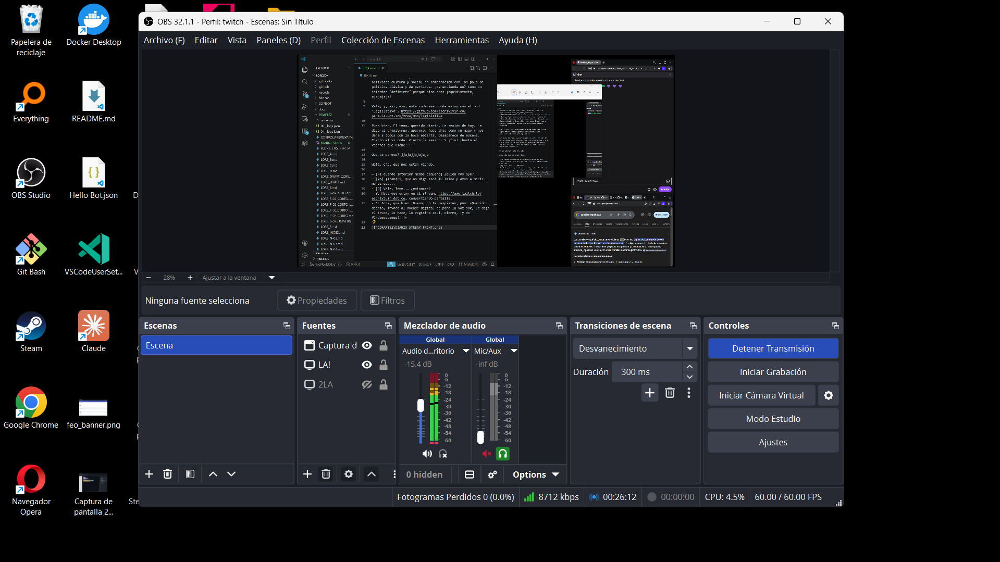
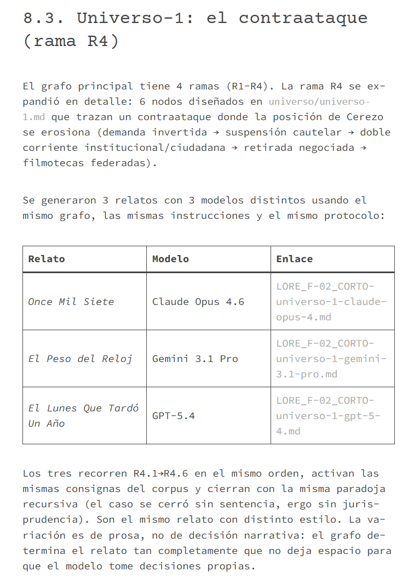
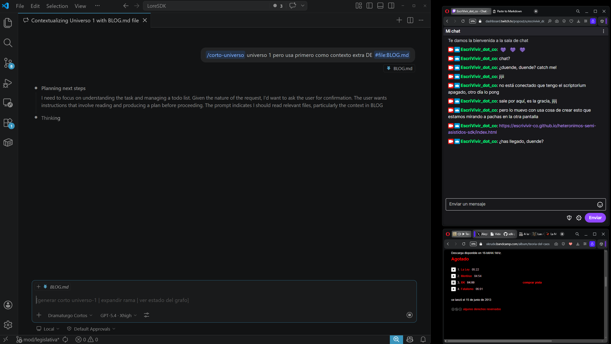
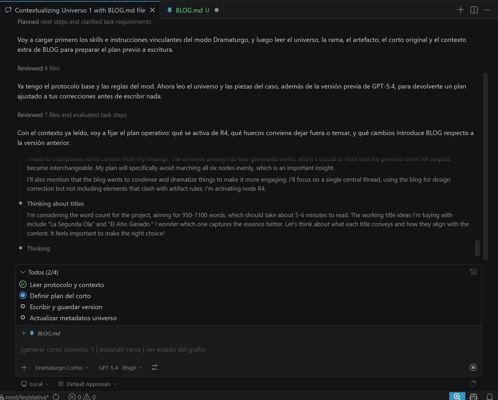

Aquella tarde de viernes no iba a salir. Me sentía realmente reventado. Así que me senté, a primera hora de la tarde, ya en modo friday-night-hacklab, con "el mundo ordinario y del negocio" empaquetado allende la escohotadiana esa línea perimetral, ¿verdad?, en mi OCIO. Ese otro espacio que comparte mucho con lo Newton (espacio referencial para inercias de masas) o esto modernito del Gravitón como gran anticristo encarnado en la Tierra del gran celeste último marco Gravedad en lo más enorme de la lejana teleología o teología o cosmología o astrología o como fuera que se le llame a lo que está fuera (y es NP) de un ser polinomial finito (P), se entiende. No va de esto el día. De qué iba, ah, sí, eso, un momento que pongo música, era ¡arranca la friday session!!!!!!!! Let's do it!!!

Y, nada, tengo una tarea para mi duende. Yo lo llamo así. Es el artefacto de pasolini en este nuevo trabajo que he pedido. ¿Conoces el poema? (https://escrivivir-co.github.io/aleph-scriptorium/poema-praxis-borrador/). Le digo duende porque un poque veo que está agentizándose conversacionalmente la escena esta digital, y hace cosas tipo, más o menos creo que tengo una cierta sincronía y verdad pero lo cierto y verdad es que vamos cada uno con nuestro lore, movie y set de apetencias y todo lo que no es pura y mera y bendita ataraxia o epoché.

La verdad que al principio de cada friday-sesion casi siempre, para saltar esta homeomorfía entre el negocio y el ocio, lo primero es lo de preguntarse si tras los 5 días (bendita huelga de la canadiense!) tipo: "¿estoy vivo?", no. Cosa de la salú, la higiene y cuanto de apremiado por la pobreza u optando al "optimo" si oneroso y pudiente. Sea como fuere, en las noches tuve tiempo de trabaja este "pagar la huella" del período actual de mi vida en un negocio bastante, como digo, típico y tópico del obrero proletario digital con su pack de derechos y esclavitudes. No me desvío, que hice esto: https://github.com/escrivivir-co/sdk-prestamos-eco-sostenibles-eco-fraternos/blob/main/sdk/lore.md. El tema es que como acumulé, quisiera poder usarlo como ocio, la idea que presenta el sdk nace de la necesidad de poder prestar tranquilo con buena conciencia y derecho a ley, doblando por donde la usura y el ánimo de beneficio no es y no tiene por qué ser la clase sino mera decoherencia. Y otros ánimos y otros qué gobiernan. Para echarle un vistazo. Sé que a la claryse esto le puede interesar. Que ella proponer y comprando y sacando espacio al commons.

Vale. Pues nada, una vez que te ves "vivo". Y mueves un poco la cola, ya sí te ves con ganas pues... ya dije yo hoy voy a mínimos. Casi que este ratín de apertura y me retiro a mis aposentos a lavarme y eso. Vale, entonces, mira tuit: https://xcancel.com/_dev_aleph_1/status/2040097030152843535#m. Pa acabar pintando el eje transversal de los piratas europeos estos con los nuevos frentes de actividad cultura y social en comparación con los polo de política clásica y de partidos. ¿Se entiende no? Como un intentar "definirte" porque sino eres ¡equidistante, ajajajaja!

Vale, y, así, eso, esta codebase donde estoy con el mod "legislativo". https://github.com/escrivivir-co/para-la-voz-sdk/tree/mod/legislativa

Pues bien. El tema, querido diario. La sesión de hoy. Le digo al dramaturgo, aparece, hace chas como un mago y nos deja a todos con la boca abierta. Desaparece de escena. Cierro el vs code. Cierro la sesión. Y ¡fin! ¡hasta el viernes que viene!!!!!!

Qué te parece? jjajajjajajaja

Wait, ojo, que nos están viendo.

— *(Mi duende interior menos pequeño, D)* ¿quién nos oye?  
— *(Yo, Y)* ¡Tranqui, que no digo eso! Tu laico y ateo a morir. No es eso...
— D: Vale, leñe... ¿entonces?
— Y: Nada que estoy en el stream: https://www.twitch.tv/escrivivir_dot_co, compartiendo pantalla.
— D: Anda, qué bien. Bueno, no te despistes, pon: «Querido diario, invoco al duende digital de para-la-voz-sdk, le digo el truco, lo hace, lo registro aquí, cierro, ¡y de findeeeeeeeee!!!!»


— D: ¡Anda, jajaja, eso sale de aquí y se y oye en la nube?
— Y: Sí sale de aquí. Pero no se ve y oye en la nube. Hay 0 espectadores, creo. Espera... Pero caso de verse y oírse sería en la Tierra, porque baja de la nube, jijijiji... mira:



— D: ¡Guay! Pues venga, dale a eso del truco, que se han venido a las puertas de la percepción un pichote de duendes de la más diversa y variopinta calaña, laya y lore. Están expectantes.
— Y: ¡Todos son yo! ¡Viva mi coleto! ¡Bienvenidos! Ostras, te has enterado del disco nuevo del "modernito" de los Habichuela, el Carmona? Va y le pone "éxodo" al disquito nuevo: "baro drom"?
— D: ¡Mírale qué gitano! Apunto eso con el latcho, que los matices lo son todo. ¿Le das al invento ese tuyo mágico/potágico? Te advierto que entre los duendes de coleto que han venido hay quienes no gustan mucho de que llames "duende digital" estas otras nuevas tecnologías de la compañía que vienes usufructuando últimamente, ¿a cómo llevas el token quemado en "atención y transformers", jajjaja?
— Y: Sí, sí... no agües la fiesta. Otra sesión, otro viernes, no te digo que te envista y entre a ese trapo. Pero ya digo que hoy vamos cortos de tiempo. Meter los pieses y volverse corriendo, jojojooj. ¿Le doy?
— D: Dale. Me retiro con los otros. Tras la cuarta pared. A verte. Como espectador. Cierro y corto.
— Y: ¡Ui, como espectador, dice! jujujuu... ¡eso suena viejuno y boomer! pre-xenial, jajajjja... métete en el stream e interactúa en el chat. jajajjajaj

*(El Duende no pequeño desaparece alejándose de mis puertas de la percepción y la conciencia inmediata; y, por eso, volátil. Con paciencia y recogimiento, notando la ausencia del duende, me centro en la tarea. Pienso que es necesario que adjunte a renglón seguido una copia del chat para que se registre por escrito esta vivencia, jajjaja, ¡escriviviviiviiiiiiiirr!)*

```txt
Te damos la bienvenida a la sala de chat
— EscriVivir_dot_co 
— EscriVivir_dot_co chat?
— EscriVivir_dot_co ¿duende, duende? catch me!
— EscriVivir_dot_co jijii
— EscriVivir_dot_co no está conectado que tengo el
 scriptorium apagado, otro día lo pong
— EscriVivir_dot_co sale por aquí, es la gracia, jijij
— EscriVivir_dot_co pero lo muevo con usa cosa de crear 
esto que estamos mirando a pachas en la otra pantalla
EscriVivir_dot_co
https://escrivivir-co.github.io/heteronimos-semi-asistidos-sdk/index.html
```
Yo recupero el contexto de la sesión de trabajo; ¡hasta las tantas ayer; con la 'idea feliz' intentando cazarla como plan! Lo dejé todo a huevo con una noticia (https://escrivivir.co/2025/11/04/t03x11-segun-la-concepcion-del-humano-asi-la-forma-politica-gastronomia-filosofica/) en la revista de la editorial con el pomposo y oneroso intitular: "La Filmoteca Maldita: mapa jurídico de las defensas, contraataques y salidas posibles
" con estos ingredientes:

— Un artefacto consumible (estándar) (pop), para una transcripción (con notas al pie como hacía la Ada por si ¡invento algo, jajajjaj!) del material (llámalo 'material' llámalo 'fumada', jajajjajaja): https://github.com/escrivivir-co/para-la-voz-sdk/blob/mod/legislativa/DRAFTS2/LORE_S-03.md. Sea como fuere, se aporta en texto lo dicho en palabra (pero con un posicionamiento editorial, transcribimos solo propositivo y hacemos el tras las noticias, ¡la verdá! jujuju)
— Luego hay 2 partes mal, pegado en plan adalove-style. Tipo: "pongo esto aquí te xinxas contemporáneo que no es para ti que estoy abriendo camino pal futuro", ¿te imaginas? , noonooonon, esto es Animus Iocandi, eh??? A mí no tomarme en serioooo, jejejej. ¡En serio te lo digo, eh! ¡no me tomes en serio! Toma, por escrito pa que luego no me hagas un Cerezo, jijij: "https://github.com/escrivivir-co/aleph-scriptorium/blob/main/LICENSE.md".
— Vale, seguimos enumerando ingredientes. Dos mal: porque esta en proceso, es todo muy reciente... ¡En serio te lo digo que estoy creando esta cosa de broma como "proceso" que no está terminado, ¡expect us, jjajjaja!

```bash
aleph@DESKTOP-7443I02 MINGW64 ~/OASIS/aleph-scriptorium/LoreSDK (mod/legislativa)
$ git log
commit 0d1bcc4e6cbad7cf0739dc204bf9b24d22a7b533 (HEAD -> mod/legislativa, origin/mod/legislativa)
Author: test <test>
Date:   Fri Apr 17 05:18:02 2026 +0200

    minor

commit 50cc13deca68469a461d042652eece5ea614c7cf
Author: test <test>
Date:   Fri Apr 17 05:00:12 2026 +0200

    content(universo-1): 3 cortos R4 — opus-4, gemini-3.1-pro, gpt-5-4
    
    — LORE_F-02_CORTO-universo-1-claude-opus-4.md
    — LORE_F-02_CORTO-universo-1-gemini-3.1-pro.md
    — LORE_F-02_CORTO-universo-1-gpt-5-4.md
    — UNIVERSO.md: campo Obras generadas actualizado

commit 06824adc92ef619a840016007ac5a0c454b3283b
Author: test <test>
Date:   Fri Apr 17 05:00:03 2026 +0200

    feat(mod): dramaturgo cortos — agente, prompt e instrucciones legislativa-universo
    
    — mod/agents/dramaturgo.agent.md
    — mod/prompts/corto-universo.prompt.md
    — mod/instructions/legislativa-universo.instructio (...)
```
— ¡Vaya enumeración larga! Menos mal que no hay ningún duende aquí, a ver *(mete en la ventana de chat un call for duende, pero no recibe respuesta)*, si lo hubiera ya me estaba llamando al orden o aprovechando que enumero mal para poner otro juego en la mesa y desviarnos ya del todo. Venga a ver. Que eso, 2 partes mal a pie de página para las notas del nuevo lenguaje, en este caso no es "sin para qué, ni sin para quién" que es para el futuro. Tema que a la aceleración a la que va esto en la IV Rev Indus, "el futuro" es pasao mañana, jjojojoj. Venga, pues: parte 1 presentar el sdk. Parte 2 lo del truco este de magia: el artefacto mío pal poema de pasolini. 

```
ref: https://escrivivir.co/s16-t001-2026-04-lo-que-no-son-habas-contadas-en-el-caso-de-la-filmo-maldita-segun-un-experto-jurista/

El repositorio tiene hoy tres capas distintas que no deben confundirse:

— El SDK agéntico de análisis documental, que vive en la rama main y define el protocolo general.
— El mod jurídico proyectado, que en la rama mod/legislativa ya está
especificado pero aún no completado como infraestructura reusable por casos.
— El lore concreto del caso, que en esa misma rama se priorizó primero como
 bootstrap documental y ya produjo un primer artefacto narrativo compuesto: LORE_F.md.
— La secuencia real de trabajo no fue: SDK → mod terminado → caso. La secuencia real
fue: SDK → especificación del mod → bootstrap del lore del caso → primer hilo narrativo →
pendiente de cierre diario + pendiente de convertir el mod en infraestructura reusable con archivo/reset.
```
— Pues eso que me hice un lío. Primero hice el chuletón del plan as usual: 

```txt
ref: https://github.com/escrivivir-co/para-la-voz-sdk/blob/mod/legislativa/DRAFTS2/mod_legislativa_INDEX.md
MOD/LEGISLATIVA — Especificación técnica
Identificador: mod/legislativa Versión: 0.1.0-draft Fecha: 2026-04-16 Estado:
BORRADOR — pendiente de validación por el promotor Base SDK: para-la-voz-sdk
 @ .github/ (inmutable desde el mod) Registro: especificación DevOps — lenguaje
normativo según convención RFC 2119 adaptada

Convención terminológica. DEBE, NO DEBE, DEBERÁ y PODRÁ tienen el significado
prescriptivo habitual. Los requisitos se numeran con prefijo de bloque (R-, A-, B-, C-, D-, E-, F-)
y cada uno referencia el artefacto de la codebase que lo implementa.
```
— Pero luego algún duende (o unos pocos) me sacarían del carril. ¡Qué rollo el plan; vamos al loreeee!

```txt
ref: https://github.com/escrivivir-co/para-la-voz-sdk/blob/mod/legislativa/DRAFTS2/LORE_PLAN.md
Guía de Producción del Lore y Product Backlog
Estado: documento rector de trabajo Ubicación: DRAFTS2/ Función: ordenar la extracción de piezas,
 la refactorización editorial y la investigación pendiente No forma parte del conteo de piezas del lore
```
— Total, que, como SCRUM obliga, yo al final tenía que tener algo pa "release". Así que recogí el escritorio y le di a "haz el truco y pétame la patata y la cabeza con algo really fresh oh-my-godess-qué-cosa. No salío. El truco se puso bien en escena pero hizo puff en el momento souflé que hace lo de la mayonesa cuando no quieren y no sube el efecto a pesar de aparentemente haber hecho bien todos los pasos (¡algo hay siempre como causa, jijijj, la receta funciona siempre, souflé y mahonesa for granted, jijiiji!!) Luego el editor me riñe porque meto paréntesis y separo la apertura del cierra del argumento dificultando, tú sabes, blibli blablbbaba:


— y, ¿pues, qué? Obvio: un skill para pintar como querer.
— Total, que, hoy, lector, chat, aquí en vivo y en directo, para todos ustedas y ustedos, vamos a repetir los pasos y esta vez sí tendremos: ¡the-big-mother-father-and-uncle-of-the-all-relatos-cortos! Y, quien sabe, si el feo sigue vivo, en libertá y no del todo y completamente borrado en pobreza y deuda, en (¿el octavo festi?): "Lo mismo nos presentamos con esto, no!!!!" jajajjajaj.

Venga, vamos al lío. Salimos de modo diario. Vamos a modo Editor Integrado de Desarrollo (el lenguaje cambia un poco, es menos personal, sabes, más reglado y formal, ¡pero funcionaa aigual!!!!)

— *(aparece sacando la cabeza al setup, como si en un teatro el actor ve que le apuntan desde bambalinas o entre los descorados. Con cuidado de que no se note trata de no perder el hilo pero atender. Es mi duende no pequeño de antes, susurra...)*

— D: ¿Todo bien? ¡Empieza ya con el truco que la audiencia está hartándose de tanto "continentalismo" y tanto "meta" alrededor del relato...
— Y: (con los ojos): ¡lárgate puto imbécil!

*(me quedo pensando que en insulto que es literal falto de batón es imbaculo, eso, imbecil, no... bueno, vamos a la faena. Entonces vamos a hacer el truco.)*

Habro el vscode. 

— Escojo al agente: mod\agents\dramaturgo.agent.md
— que es customizacion del orignal del sdk: .github\agents\dramaturgo.agent.md
— le pongo el prompt: mod\prompts\corto-universo.prompt.md

Le recuerdo que lo que hicimos la otra vez resulto en esto:

[DRAFTS2](https://github.com/escrivivir-co/para-la-voz-sdk/blob/mod/legislativa/DRAFTS2/LORE_F-02_CORTO.md):

- DRAFTS2\LORE_F-02_CORTO-universo-1-claude-opus-4.md
- DRAFTS2\LORE_F-02_CORTO-universo-1-gemini-3.1-pro.md
- DRAFTS2\LORE_F-02_CORTO-universo-1-gpt-5-4.md
- DRAFTS2\LORE_F-02_CORTO.md

Y le pongo unos parámetros de correción sobre lo anterior para guiarle y pedir. ¡Haz los pases mágicos ychan que aparezca el "nuevo universo diseñado", el nuevo corto, chillándole con júbilo y espectación:

— ¡UN NUEVO CORTO!

Lista de nos:

- No a relatos tan largos con la mitad basta
- No a "no rellenar con relato y trama" pero parecerlo. O dato, o relato, o, bueno, sí, también, por qué no, datos y relatos, pero bien marcado.
- A ver punto central, aquí queremos una tensión dramática que lleve al lector a un "diseño universo". Es nuestra visión, sin más, de qué podía pasar. Ni siquiera son importantes el feo y el cerezo. Al final, es comedia típica que encuentra un hilo posible (bajo probable, jajajjaja) para dibujar el mundo.
- Entonces menos chimi-chimi y lapidarias raras y más atenerse a las instrucciones de la sdk para generar un nuevo relato: más simple, más grabable para corto de 7 minutos, más mover las piezas para presentar que reinventar una rueda que ya está inventada.
- tensiones principales, tenemos ya documentado con el indefenso feo ahora se sube en la segunda ola, la cosa escala e institucionalmente se encargan de la defensa. Esa linea la tenemos bien "posibilizada". 
- Entonces es una salida primera porque antes la fuerzar de egeda comparada con el individuo se equilibra. Eso es un primer tramo del camino. Seguimos, se le levanta pasado a cerezo, ya tenemos que al final lo que cogía regalado ahora se vincula a otras veces que lo cogio mal y se le planta la enorme tarea de demostrar propiedades y los casos de "indebidos". 
- Eso el nuevo equipo lo pelea (me imagino a cristobal trabjando en la sombra el argumentario, david defendiendolo en direct ante juricatura, ruben explicando el relato en los medio. 
- Entonces la tensión de crece el radicoma distribuido lo tenemos bien en piezas, la indignacion fue la salida a las plzas y presentarse cmo unidad organizda. Un primer paso. Se repite, pero ahora las que salen (menos numerosas en unidad pero más unidades por todo el territorio) ahora ya tienen una tarea que operar y el impulso no se disuelve cuando se instucionliza como en la primera ornada sino que se mantiene con las dos cabezas. Al final el relato acaba con un ecosistema mas o menos modesto, una ferderación al uso desde la Filmoteca de ESpaña pasando por las filmotecas estatales, y de ahi a la de barrios. La tensión de nuestro corto habla de cómo florecen en el cntexto que hemos explicado. Al final del relato otros problemas esperan, otras tensiones, por ejemplo, como los cantones en la primera. Puede finalizar el texto propniendo eso. Que una vez alli estan con la estructura surgen tensiones que debera´n resolvers sin que acabe por romper desde dentro o alguien diga "no era esto! no era esto" en una rectificación de la república (nota esto es cita de J.O.).
- Como ese tandem sube en la segunda hola y se transforma en un aparto institucional legal asociado a la filmo generica donde lo mismo se continua dando para ya a otra escala. Es otro desgaste para que cerezo llega al convencimiento de que no es tan facil capturar esa presa y se cansa. 
- Da para el futuro en nuestro cierre donde tnegran que versela entonces el comercio privado con una nacionalizacon de insfraestrutcura que arrecia en ese momento, como telefonica en su momento, etc...)


Lista de síes:

- Pues eso que está todo. Solo hay que compactar, dramatizar, hacer más pop.

*(Hace lo que ha dicho y toma captura del duende digital dramaturgo apareciendo en escena)*



*(El duende hace lo suyo un rato, crea un plan...)*



```md
Plan

1.  Nodos que activaré: R4.1 como giro de fuerza con el dato 11.007 vs 40; R4.2 como bisagra dramática; R4.3 y R4.4 fundidos como doble cabeza de la segunda ola; R4.6 como imagen final del mundo nuevo. R4.5 aparecerá solo como consecuencia breve, no como estación autónoma.
2.  Tensión central: un caso montado para disciplinar a un individuo acaba abriendo el tiempo y el espacio para que se forme una estructura colectiva más difícil de capturar. La comedia está ahí: no en el chiste verbal, sino en la inversión del tablero.
3.  Huecos que dejo abiertos: H2 queda como sombra y no se resuelve; H3 no se doctrinaliza y se compacta como contraataque mercantil-cultural; H4 se deja en financiación mixta sin detalle; H5 lo fijaré como rama posible donde Bravo sostiene lo penal, Cristóbal empuja el argumentario y Rubén la amplificación; H6 se apoya en la base legal del RD 2016 sin dramatizar el trámite exacto.
4.  Registro literario: narración omnisciente fría. Es el registro más útil para marcar bien dato y relato, evitar chimichimi y sostener un corto más grabable.
5.  Estructura propuesta: movimiento 1, el lunes preparado para aplastar; movimiento 2, el dato que da la vuelta al relato; movimiento 3, el lunes se convierte en un año; movimiento 4, las dos cabezas de la defensa; movimiento 5, la federación modesta y la nueva tensión interna que queda abierta.
6.  Duración estimada: 5 a 6 minutos. Apunto a una pieza claramente más corta que la versión previa, alrededor de 900 a 1100 palabras.
```

*(acaba de hacer "la preparación" del truco, acaba de dar pases mágicos; se cerciora de que efectivamente la precisa secuencia de pasos ha terminado y a producirse la emergencia mágica... y dice: "eh, bualá!" presentando el efecto mágico...)*

*(Se oye: "pluf...". El souflé no sube. La mohonesa no se une ni la nata se monta. Esta vez no. Se requiere, otra vez, de repetir esto y una lista de "síes", y otra de "noes" para, desde lo que sí ha entrado, avanzando en la reducción y eliminación de error. Otra forma, lector, chat!!!, ¡otra forma no conozco de hacerlo! jajajjaja ¡a prueba y error!)*

Continuará.

*(Sale de escena. Cae telón. Fuera focos. Botón del streameador: "detener misión". Fundido negro)*

— Y: ¿Ya?
— D: *(aparece por el tunel y me busca tras el escenario)*: ¿Oye, he visto esto?
— Y: ¿Y?
— D: Algo he pillado. Me parece interesante. Tengo un remate final. ¿Te lo digo?
— Y: Dale
— D: Es pensando mientras te veía. "Las palabras mías", las nuestras que usábamos antes. Tu mago duende no ha dicho las palabras mágicas antes de invocar al efecto. A lo mejor ha sido eso el bluf, no?
— Y: No creo. Sí las dijo. Ahora las "palabras mágicas" se dice "prompt", lo mismo que corteja se empezó a decir "ligar" y ahora eso suena acrónico y es "frontear". Cosas de alejarse de la idea castrense del amor cortés.
— D: ¿Ah, sí? ¿Y cuáles fueron estas palabras mágicas.
— Y: Anota.
— D: *(Diligente busca en el bolsillo interior de la chaqueta el cuadernito, lo abre por sito en blanco, saca el lapicito de la oquedad en la bisagra del cuaderno, carboncillo, lo lenguetea y queda apuntando la punta a rás de hoja, me mira)* Dale.
— Y: Apunta: "/corto-universo universo1"

*(otro fundido negro, el bueno, see you en siete)*
