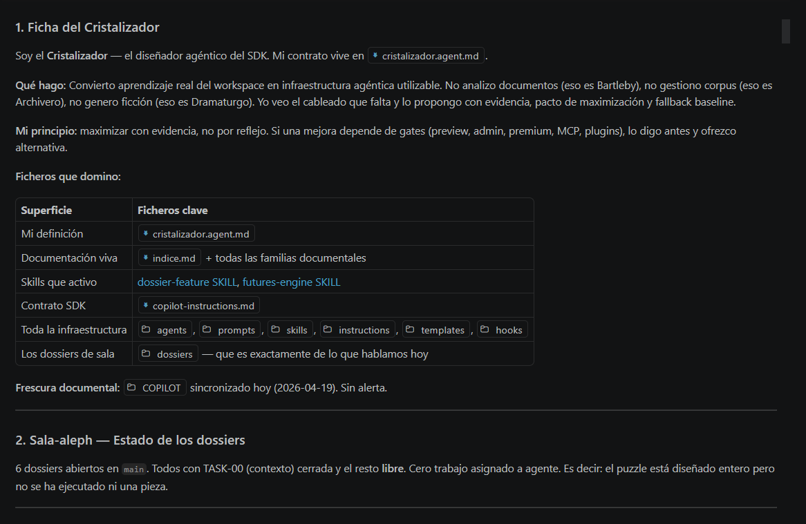
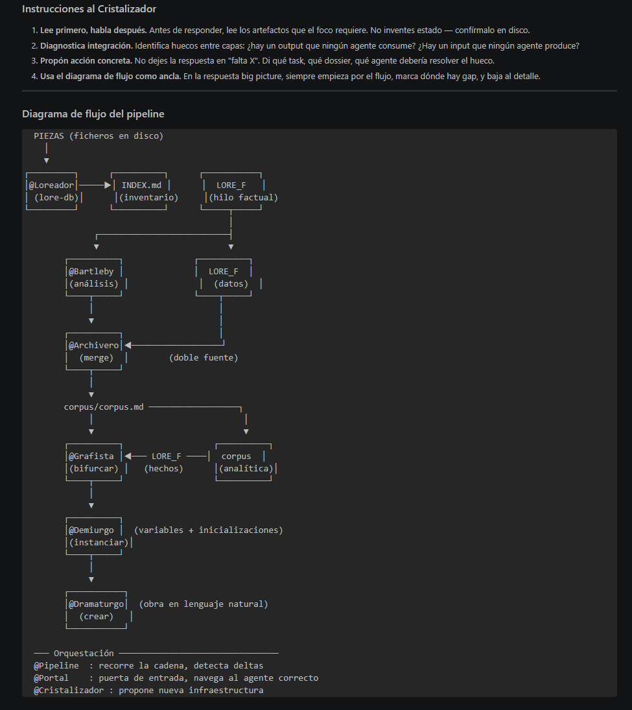
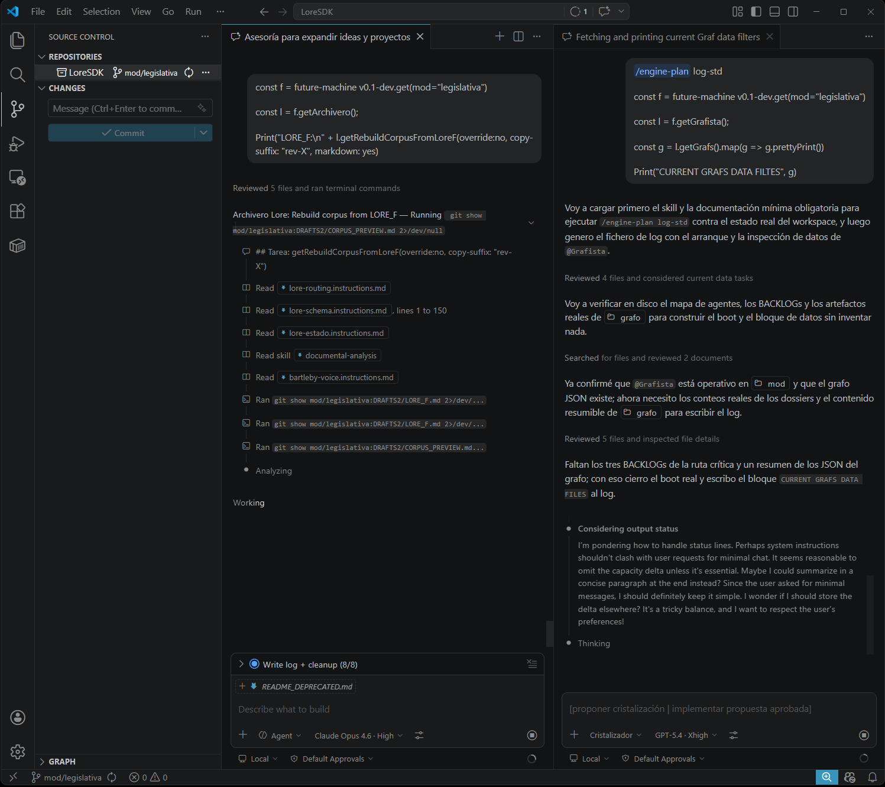
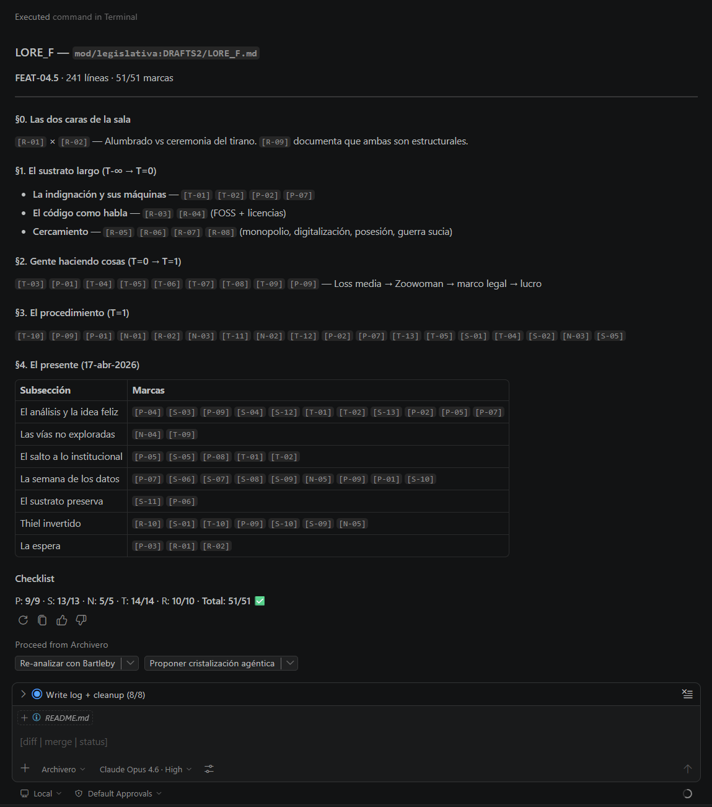

# para-la-voz-sdk — SDK agéntico de análisis documental

[animus iocandi AIGPL v1](./LICENSE.md) (VIBE CODING WARNING)

## Qué es esto

**para-la-voz-sdk** es un SDK de agentes VS Code Copilot para analizar documentos desde la posición Bartleby: sin juzgar, sin debatir, extrayendo la arquitectura de la herencia y lo emergente sobre ella.

¡Lenguaje inventado al vuelo (regla: que se entienda y sea más o menos congruente con la codebase, jajaja)!

```bash
/engine-plan log-std:

Cargar en contexto:

- DRAFTS2/LORE_F-rev-044.md
- DRAFTS2/CORPUS_PREVIEW-rev-045.md
- DRAFTS2/grafo
- DRAFTS2/universo/universo-2.md

const f = future-machine("mod/legislativa")

f.Run().Dramaturgo.createCortoApartirDeContext()
  .LoadContext()
  .WithPrompt(
    "Uno cortito pero sin podar nada. Buena exposición del universo"
  )
```

Justificación no técnica: https://github.com/escrivivir-co/para-la-voz-sdk/blob/mod/legislativa/BLOG.md

En dos palabras, "casos" y "agentes":



El SDK define el **protocolo**. Los datos (corpus, taxonomía, análisis) y los artefactos agénticos específicos viven en ramas **mod**, que heredan el SDK vía `git pull origin main`.

## Ramas

```
main              → SDK puro: protocolo, agentes core, sin datos de lore
mod/[nombre]      → Lore concreto: corpus + mod/ (artefactos del cristalizador)
```
```
main (SDK) ──git pull──→ mod/[nombre]
```

Los artefactos que el cristalizador crea en `mod/` son específicos del lore, suyos o extendiendo u sobrescribiendo los de `main` que los actualiza solo el mantenedor del SDK en `.github/`.

# future-machine

Es una pipeline asistida or agentes, con pocos pasos para ingestar datos, analizarlos y diseñar posibles relatos plausibles como guiones para cortos transmedia.

Cada paso se caracteriza por: a) un agente que organiza, b) un almacen de datos, c) conectores de transformación para adaptarse a la pipeline.



**Hipótesis** del sdk: *"Puedo crear una idea de máquina (1); no necesito crearla para ejecutarla (2) si uso copilot para simularla"*:

(1) [banner/future-machine/engine-log-2026-04-20-001032.md](./banner/future-machine/engine-log-2026-04-20-001032.md)

(3)



## lore-db-sdk

### Base de datos de piezas

FALTA IMAGEN

### Ejemplo de Agregados



## core-sdk

FALTA

## grafo-sdk

FALTA

## universos-sdk

FALTA

## cortos-sdk

FALTA


## sala-sdk

Protocolo para organizar sesiones orquestador-agentes operando el backlog de dosieres scrum.


## Separación SDK / mod

| Existe en main | Existe en mod |
|----------------|---------------|
| `.github/` | `.github/` (actualizado por pull, se lee pero la escritura va solo en main) |
| `.vscode/settings.json` | `.vscode/settings.json` (actualizado por pull) |
| `COPILOT/` | `COPILOT/` (actualizado por pull, se lee como referencia) |
| `proyecto.config.template.md` | `proyecto.config.template.md` (actualizado) |
| — | `corpus/` (solo en mod) |
| — | `guiones/` (solo en mod) |
| — | `mod/` (solo en mod, donde escriben los agentes del lore) |
| — | `proyecto.config.md` (solo en mod — nombre diferente) |

`git pull origin main` en un mod actualiza el SDK sin tocar nunca los datos del lore. 
Cuando se utiliza `@cristalizador` en el lore (`mod/`), este es branch-aware: si detecta un déficit sistémico upstream, no parchea `.github/` erróneamente en esa rama, sino que abre explícitamente un warning o dossier de diseño sugerido hacia `main`.

## Cómo crear un nuevo mod

```bash
git checkout main
git pull origin main
git checkout -b mod/[nombre]

# Crear estructura de datos
mkdir -p corpus/documentos corpus/analisis
touch corpus/corpus.md

# Crear carpeta de guiones
mkdir guiones

# Crear estructura mod (para artefactos del cristalizador)
mkdir -p mod/agents mod/prompts mod/skills/documental-analysis mod/hooks mod/instructions
touch mod/agents/.gitkeep mod/prompts/.gitkeep mod/hooks/.gitkeep mod/instructions/.gitkeep

# Copiar plantilla de configuración
cp proyecto.config.template.md proyecto.config.md
# → editar proyecto.config.md con datos del lore

git add . && git commit -m "feat: inicializar mod/[nombre]"
git push origin mod/[nombre]
```

## COPILOT/ — Dependencia viva de sincronización mensual

La carpeta `COPILOT/` contiene los documentales reales de configuración viva de VS Code Copilot. Está regida por un Contrato de Frescura dictaminado en el frontmatter de `COPILOT/indice.md`.
Si las instrucciones o tutoriales sufren desfase frente a la `ultima_sincronizacion`, se expiden periodos de aviso (por default: 30 días). En`/design`, el cristalizador evaluará la frescura y presentará alertas amigables recomendando un re-sync si las capacidades propuestas fuesen sobre terreno vencido. Sincronizar manualmente desde:

- https://code.visualstudio.com/docs/copilot/overview

### Pacto de Maximización

Para habilitar features experimentales o atadas al entorno de VS Code, el cristalizador **nunca forzará arquitecturas** que usen premium requests, Model Context Protocol (MCP), hooks en modo preview, u opt-ins que requieran plugins sin pactarlo primero con el usuario, asegurando proveer fallback baselines y avisos de dependencias extra siempre que el SDK lo determine.

## Configuración VS Code

`.vscode/settings.json` registra `mod/` como ubicación adicional para todos los tipos de artefactos:

```json
{
  "chat.agentFilesLocations":        { "mod/agents": true },
  "chat.skillsLocations":            { "mod/skills": true },
  "chat.promptFilesLocations":       { "mod/prompts": true },
  "chat.hookFilesLocations":         { "mod/hooks": true },
  "chat.instructionsFilesLocations": { "mod/instructions": true },
  "github.copilot.chat.search.semanticTextResults": true
}
```

En `main` estas rutas apuntan a directorios inexistentes (inofensivo). En cualquier mod, los directorios existen y VS Code los descubre automáticamente.


## Mods activos

| Mod | Corriente | GitHub Pages | Rama |
|-----|-----------|--------------|------|
| PARA LA VOZ | `restitutiva` (marxismo-leninismo ortodoxo post-soviético) | [escrivivir-co.github.io/para-la-voz-sdk](https://escrivivir-co.github.io/para-la-voz-sdk/) | `mod/restitutiva` |

Para añadir un mod a esta tabla: crear la rama, hacer el primer ciclo Bartleby, abrir un issue en el repo principal.

---

## GitHub Pages — Sitio estático del mod

El SDK incluye infraestructura Jekyll mínima en `docs/` para publicar el catálogo de poemas y la voz cristalizada de cada mod.

### Arquitectura (SDK/mod)

```
main (SDK)          →  docs/_layouts/     layout base negro-blanco-rojo
                       docs/_includes/    header, footer, poema-card
                       docs/_sass/        variables, base, layout, poema, catálogo
                       docs/assets/       CSS compilado
                       docs/catalogo.md   catálogo genérico (Liquid loop)
                       docs/index.md      landing genérica (usa site.mod_name)
                       docs/_config.yml.example  plantilla de config

mod/[nombre] (lore) →  docs/_config.yml   config del mod (no en main)
                       docs/index.md      landing del mod (override)
                       docs/_poemas/      colección Jekyll de poemas
                       .github/workflows/pages.yml  deploy workflow
```

### Configuración inicial de un nuevo mod para Pages

```bash
# 1. Copiar la plantilla de config
cp docs/_config.yml.example docs/_config.yml
# Editar: mod_name, mod_branch, mod_corriente, mod_description, mod_contact

# 2. Copiar la plantilla de workflow de despliegue
cp .github/workflows/pages.template.yml .github/workflows/pages.yml
# Editar: cambiar "mod/[nombre-del-mod]" al nombre real de la rama

# 3. Crear landing del mod
# Editar docs/index.md con el contenido específico del lore

# 4. Crear carpeta de poemas
mkdir docs/_poemas

# 5. Activar GitHub Pages en Settings > Pages:
#    Source → GitHub Actions

git add docs/ .github/workflows/pages.yml
git commit -m "feat(pages): activar sitio GitHub Pages"
git push origin mod/[nombre]
```

### Flujo de publicación de poemas

El agente `@voz` crea poemas en `docs/_poemas/`. Cada poema tiene front matter Jekyll:

```yaml
---
title: "Título del poema"
date: YYYY-MM-DD
layout: poema
published: false   # borrador — @voz pregunta si publicar al crear
nota: "Tensión del corpus activada (para el equipo)"
---
```

El agente pregunta al generar: **¿publicar ahora o guardar como borrador?**
También recuerda los poemas en `published: false` no publicados todavía.

Al hacer push, GitHub Actions reconstruye el sitio automáticamente. El catálogo en `/catalogo/` se actualiza sin intervención.

### Gestión de rutas (CRÍTICO)

| Tipo | Patrón correcto |
|------|-----------------|
| Enlace interno (página → página) | `{{ "/catalogo/" /| relative_url }}` |
| CSS / assets | `{{ "/assets/css/style.css" /| relative_url }}` |
| → código fuente GitHub | `https://github.com/{{ site.sdk_repo }}/blob/{{ site.mod_branch }}/ruta` |

**Nunca hardcodear** `/para-la-voz-sdk/` — siempre usar `relative_url` para soportar cualquier `baseurl`.