# Red semántica de LORE_F-rev-044.md

> 51 nodos (piezas) · 115 arcos de co-ocurrencia · relaciones semánticas cualificadas
> Generado por Claude Opus 4.6 · 20-abr-2026
> Fuente: `DRAFTS2/LORE_F-rev-044.md` (FEAT-04.4, 250 líneas, 51/51 piezas)

---

## Leyenda de tipos de arco

| Símbolo | Relación | Dirección |
|---------|----------|-----------|
| `→` | causa / produce / desencadena | dirigida |
| `↔` | oscilación / dualidad / tensión | bidireccional |
| `⊃` | contiene / enmarca / es instancia de | contención |
| `⊕` | amplifica / refuerza | dirigida |
| `⊖` | contradice / invierte / desmonta | dirigida |
| `≈` | análogo / espejo / replica | bidireccional |
| `···` | co-ocurrencia textual sin relación semántica fuerte | no dirigida |

---

## I. Árbol de significado — vista por capas

```
                        ┌─────────────────────────────────────┐
                        │   CAPA 0: COORDENADAS DE LECTURA    │
                        │                                     │
                        │     [R-01] ↔ [R-02]                │
                        │   alumbrado ↔ ceremonia             │
                        │        ↕ oscilación                 │
                        │       [R-09]                        │
                        │  (aparato judicial real)            │
                        └──────────┬──────────────────────────┘
                                   │ enmarca
            ┌──────────────────────┼──────────────────────────┐
            ▼                      ▼                          ▼
┌───────────────────┐  ┌───────────────────┐   ┌──────────────────────┐
│ CAPA 1: SUSTRATO  │  │ CAPA 2: EL CASO   │   │ CAPA 3: SUPERFICIE   │
│   LARGO (§0-§1)   │  │   NACE (§2-§3)    │   │   MEDIÁTICA (§4)     │
└───────────────────┘  └───────────────────┘   └──────────────────────┘
```

---

## II. CAPA 1 — Sustrato largo: condiciones de posibilidad

### Cluster A: Indignación → institucionalización

```
[T-01] ──→ [T-02] ──→ [P-02] + [P-07]
 indignación   instituc.   Bravo    Rubén
                           │         │
                           └──┬──────┘
                              │ precedente
                              ▼
                          [T-12] juicio
```

**Significado:** La indignación de 2008 `[T-01]` se institucionaliza `[T-02]` en figuras como Bravo `[P-02]` y Rubén `[P-07]`. Ambas personas terminarán interviniendo en el caso años después. El sustrato produce a sus propios actores.

### Cluster B: La escena FOSS y el marco legal

```
[R-03] ──→ [R-04] ──→ [R-05]
 escena       licencias    monopolio
 FOSS         como gradac.  como eficiencia
  │              │              │
  │              │              └──→ [P-09] Cerezo (Thiel aplicado)
  │              │
  └──────────────┴──→ [R-06] digitalización vs feudos
                          │
                          ├──→ [R-07] posesión vs suscripción
                          │       │
                          │       └──→ [T-05] loss media (consecuencia)
                          │
                          └──→ [R-08] Windows vs Linux
                                  │
                                  └──≈ caso Zoowoman (victoria selectiva)
```

**Significado:** La escena FOSS `[R-03]` establece el marco cultural; las licencias `[R-04]` cartografían las posiciones legales; Thiel `[R-05]` aporta la doctrina del monopolio que explica el comportamiento del demandante. La digitalización `[R-06]` crea el campo de batalla, la pérdida de posesión `[R-07]` genera loss media `[T-05]`, y la guerra Windows/Linux `[R-08]` funciona como análogo estructural del caso.

### Cluster C: Amor al cine → infraestructura comunal

```
[T-04] ──→ [T-03] ──→ [P-01]
 amor al      gente       Feo
 cine         haciendo     │
              cosas        ├──→ [T-06] Zoowoman (la respuesta)
                           │       │
                           │       └──⊃ [T-05] loss media (el fenómeno)
                           │
                           └──→ [T-07] + [T-08]
                                marco legal    "apropiarse"
```

**Significado:** El impulso individual `[T-04]` de Feo `[P-01]` crea la infraestructura `[T-06]` que responde al fenómeno de loss media `[T-05]`. Pero el marco legal `[T-07]` no distingue rescate de piratería, y el acto de "apropiarse" `[T-08]` queda tipificado sin matices.

---

## III. CAPA 2 — El caso nace: procedimiento y lucro

### Cluster D: El conflicto central

```
                  [P-09] Cerezo/EGEDA ──→ [T-10] CAUSA
                       │                     │
                       │                     ├──→ [T-11] demora 4 años
                       │                     │
          [N-01] ──⊖── ┘                    ├──→ [T-13] penas: 870K€ + 2.5 años
         (condena propia                     │       │
          del demandante)                    │       └──→ [T-05] (¿repo = loss media?)
                                             │
                  [P-01] Feo ◄───────────────┘
                       │
                       ├──→ [S-01] "Os explico mi detención"
                       │       │
                       │       └──→ [T-04] "El cine es nuestro"
                       │
                       └──→ [S-02] "Algo sobre MI JUICIO"
                               │
                               ├──⊖── [N-03] Diario de Burgos (pirata)
                               │
                               └──→ [S-05] clip Facu→Bustinduy
```

**Significado:** La causa `[T-10]` nace de Cerezo `[P-09]` contra Feo `[P-01]`. La ironía estructural: `[N-01]` documenta que el propio demandante tiene condena previa. Los testimonios de Feo `[S-01]` `[S-02]` construyen contra-relato ante el encuadre de prensa `[N-03]`.

### Cluster E: El debate del lucro

```
          [T-09] El lucro (eje decisivo)
              │
              ├── lucro directo ──⊖── [S-01] [S-03] (negado)
              │
              ├── lucro indirecto ──⊖── [S-02] (12K€ desmentidos)
              │                         │
              │                         └──⊖── [N-03] "ecosistema"
              │
              └── lucro cesante ──→ [T-13] 870K€
                                    │
                                    └──⊖── [S-10] "11.007 vs 40"
```

**Significado:** El lucro `[T-09]` es el eje de la acusación. Tres vectores, los tres contradichos por piezas del corpus. `[S-10]` es la inversión más potente: de 11.007 títulos reclamados, solo 40 están acreditados.

---

## IV. CAPA 3 — Superficie mediática: la semana de espera

### Cluster F: La defensa y el análisis

```
[P-02] Bravo ──→ [T-12] juicio (9-abr)
    │                │
    │                └──→ [P-03] juez (espera) ──→ [T-14] veredicto
    │                         │
    │                    [R-01] ↔ [R-02] (¿cuál será?)
    │
    └──→ [P-04] Cristóbal ──→ [S-03] 83 min análisis
              │                   │
              │                   └──→ [S-04] idea feliz (emergencia)
              │                            │
              │                            └──→ [S-12] segunda ola operativa
              │
              └──→ [N-04] nueve ejes no explorados
                      │
                      └──→ [T-09] ánimo/dolo
```

### Cluster G: El salto institucional

```
[P-05] Facu ──→ [S-05] stream con Bustinduy
    │               │
    │               └──→ [P-08] Bustinduy: "que se estudie"
    │
    │   ┌── [T-01] indignación
    │   │       │
    └───┤       ▼
        └── [T-02] institucionalización
                │
                └──→ [P-08] recibe el caso de vuelta
```

**Significado:** El caso cruza la membrana stream→institución. La indignación `[T-01]` que se institucionalizó `[T-02]` en Bustinduy `[P-08]` recibe el caso por ruido distribuido, no por dossier.

### Cluster H: La segunda ola — datos duros

```
[S-09] Bizarro: datos Cerezo ──→ [P-09] retrato documentado
    │                               │
    │                               └──→ [N-01] (condena previa, misma persona)
    │
    ├──→ [N-05] Xataka: cobertura tech
    │       │
    │       ├──→ [P-01] rechaza acuerdo 100K€
    │       │
    │       └──→ [P-09] Mercury: 70-80% cine español
    │
    └──→ [S-10] "11.007 vs 40"
            │
            └──→ [N-04] estrategia de desgaste (eje 9)
```

### Cluster I: El sustrato preserva

```
[S-11] 4 personas preservan YouTube ──→ [P-06] sustrato actúa
    │                                       │
    │                                       └──⊕── presión colectiva
    │
    └──→ valor del archivo = conversación, no películas
```

### Cluster J: Thiel invertido — closing frame

```
[R-10] "Thiel invertido"
    │
    ├──⊃ [S-01] commons cuida lo invisible
    ├──⊃ [T-10] + [P-09] incumbente activa aparato
    ├──⊃ [S-10] 11.007 vs 40
    ├──⊃ [S-09] 5 antidisturbios
    ├──⊃ [N-05] acuerdo 100K€ rechazado
    │
    └──⊖── [R-05] Thiel original: el monopolio como eficiencia
              se invierte: la densidad del aparato = coste para quien lo activa
```

**Significado:** `[R-10]` es la pieza de cierre que relee toda la capa de superficie desde el sustrato largo. El monopolio `[R-05]` predice que el incumbente destruye alternativas; pero la acumulación de datos `[S-09]` `[S-10]` `[N-05]` invierte el vector: quien reclama masivamente asume el coste de probar lo que reclama.

---

## V. Tabla de centralidad (piezas ordenadas por grado)

| Pieza | Tipo | Grado | Rol en la red |
|-------|------|-------|---------------|
| `P-09` | Personaje | 12 | **Hub antagonista**: Cerezo conecta causa, penas, datos, prensa |
| `S-09` | Social | 11 | **Hub evidenciario**: datos Bizarro irradian a toda la superficie |
| `N-05` | Noticia | 11 | **Hub mediático**: Xataka como primer análisis masivo |
| `S-10` | Social | 10 | **Dato-inversión**: 11.007 vs 40 conecta lucro, desgaste, Thiel |
| `R-10` | Recurso | 10 | **Frame de cierre**: Thiel invertido relee toda la red |
| `S-06` | Social | 9 | **Posición reservada**: alta co-ocurrencia por checklist, sin contenido |
| `S-08` | Social | 9 | **Posición reservada**: idem |
| `T-14` | Fase | 8 | **Nodo terminal**: el veredicto como destino de todos los arcos |
| `P-01` | Personaje | 7 | **Protagonista**: Feo conecta origen, causa, testimonios |
| `S-01` | Social | 7 | **Primer testimonio**: ancla de posición (comunal, no lucro) |
| `T-10` | Fase | 7 | **La CAUSA**: nodo bisagra entre §2 y §3 |
| `S-02` | Social | 7 | **Contra-relato**: desmonta encuadre del Diario |
| `S-11` | Social | 6 | **Acción preservadora**: el sustrato actúa |
| `P-02` | Personaje | 5 | **Letrado**: Bravo conecta FOSS, institución, juicio |
| `S-05` | Social | 5 | **Cruce de membranas**: stream→institución |
| `T-13` | Fase | 5 | **Las penas**: nodo cuantitativo, 870K€ |
| `P-07` | Personaje | 5 | **Amplificador**: Rubén conecta FACUA, segunda cola |
| `S-03` | Social | 5 | **Análisis 83min**: Cristóbal como generador |
| `N-03` | Noticia | 5 | **Encuadre hostil**: Diario de Burgos, "pirata" |
| `N-02` | Noticia | 4 | **Contraplano**: Diario Socialista invierte el frame |
| `S-12` | Social | 4 | **Segunda ola**: idea feliz como forma operativa |
| `S-13` | Social | 4 | **Soporte sin anclaje**: pieza disponible para corpus |
| `T-04` | Fase | 3 | **Motor afectivo**: amor al cine como origen |
| `R-01` | Recurso | 3 | **Cara 1**: alumbrado |
| `R-02` | Recurso | 3 | **Cara 2**: ceremonia |
| `T-12` | Fase | 3 | **Juicio**: 9-abr, nodo temporal |
| `T-02` | Fase | 3 | **Institucionalización** |
| `P-06` | Personaje | 2 | **Sustrato colectivo** |
| `P-05` | Personaje | 2 | **Puente**: Facu, stream→institución |
| `P-08` | Personaje | 2 | **Institución**: Bustinduy |
| `S-07` | Social | 2 | **Posición reservada** |
| `N-04` | Noticia | 2 | **Ejes no explorados** |
| `T-05` | Fase | 2 | **Loss media** (el fenómeno) |
| `P-03` | Personaje | 2 | **El juez**: silencio como significado |
| `P-04` | Personaje | 2 | **Analista**: Cristóbal |
| `N-01` | Noticia | 1 | **Ironía**: condena propia del demandante |
| `T-03` | Fase | 1 | **Gente haciendo cosas** |
| `S-04` | Social | 1 | **Emergencia**: la idea feliz |
| `T-01` | Fase | 1 | **Origen**: la indignación |
| `T-09` | Fase | 1 | **Eje legal**: el lucro |
| `T-11` | Fase | 1 | **Castigo procesal**: demora |
| `T-06` | Fase | 1 | **Zoowoman** (la infraestructura) |
| `R-09` | Recurso | 0 | **Dato verificable**: aparato judicial español (enmarca §0) |
| `R-03` | Recurso | 0 | **Escena FOSS**: condición de posibilidad |
| `R-04` | Recurso | 0 | **Licencias**: gradación de derechos |
| `R-05` | Recurso | 0 | **Thiel original**: monopolio como eficiencia |
| `R-06` | Recurso | 0 | **Digitalización vs feudos** |
| `R-07` | Recurso | 0 | **Posesión vs suscripción** |
| `R-08` | Recurso | 0 | **Windows vs Linux**: análogo |
| `T-07` | Fase | 0 | **Marco legal** |
| `T-08` | Fase | 0 | **"Apropiarse"**: el acto tipificado |

> Grado 0 = la pieza aparece sola en su párrafo (no co-ocurre con otras). Su significado es contextual, no relacional dentro del texto.

---

## VI. Arcos de significado más densos

Las 10 relaciones con mayor peso semántico (combinando co-ocurrencia + cualificación manual):

| # | Arco | Tipo | Peso | Significado |
|---|------|------|------|-------------|
| 1 | `R-01` ↔ `R-02` | dualidad | 2 | Las dos caras de la sala: la oscilación del sistema judicial |
| 2 | `P-01` ↔ `P-09` | antagonismo | 2 | Feo vs Cerezo: el conflicto central del caso |
| 3 | `N-03` → `S-02` | contradicción | 3 | Encuadre "pirata" del Diario, desmentido 4 años después por Feo |
| 4 | `S-10` ⊖ `T-13` | inversión | 2 | 11.007 vs 40: la reclamación se vuelve indefendible a escala |
| 5 | `R-10` ⊖ `R-05` | inversión | impl. | Thiel invertido: el aparato se vuelve coste para quien lo activa |
| 6 | `T-01` → `T-02` → `P-08` | cadena causal | 1+1 | La indignación se institucionaliza y recibe el caso de vuelta |
| 7 | `T-04` → `T-03` → `P-01` | cadena motriz | 1 | Amor al cine → gente haciendo cosas → Feo crea Zoowoman |
| 8 | `P-06` ↔ `S-11` | acción recíproca | 2 | El sustrato no solo amplifica — preserva |
| 9 | `S-09` ⊕ `N-05` | refuerzo | 3 | Datos duros de Bizarro son materia prima del análisis de Xataka |
| 10 | `P-02` → `T-12` | intervención | 2 | Bravo asume la defensa en juicio, cierra arco institucional |

---

## VII. Grafo en formato DOT (para visualización)

```dot
digraph LORE_F {
  rankdir=TB;
  node [shape=box, style=rounded, fontname="Helvetica"];

  // ── CAPA 0: Coordenadas ──
  subgraph cluster_0 {
    label="§0. Coordenadas de lectura";
    style=dashed; color=gray;
    R01 [label="[R-01]\nalumbrado"];
    R02 [label="[R-02]\nceremonia"];
    R09 [label="[R-09]\naparato judicial"];
    R01 -> R02 [dir=both, label="oscilación", color=purple];
    R09 -> R01 [style=dashed, label="verifica"];
    R09 -> R02 [style=dashed, label="verifica"];
  }

  // ── CAPA 1: Sustrato largo ──
  subgraph cluster_1 {
    label="§1. Sustrato largo";
    style=dashed; color=blue;

    T01 [label="[T-01]\nindignación"];
    T02 [label="[T-02]\ninstitucionalización"];
    P02 [label="[P-02]\nBravo"];
    P07 [label="[P-07]\nRubén"];
    R03 [label="[R-03]\nescena FOSS"];
    R04 [label="[R-04]\nlicencias"];
    R05 [label="[R-05]\nThiel/monopolio"];
    R06 [label="[R-06]\ndigitalización"];
    R07 [label="[R-07]\nposesión vs suscripción"];
    R08 [label="[R-08]\nWindows vs Linux"];
    T05 [label="[T-05]\nloss media"];

    T01 -> T02 [label="produce"];
    T02 -> P02 [label="cristaliza en"];
    T02 -> P07 [label="cristaliza en"];
    R03 -> R04 [label="funda"];
    R04 -> R05 [label="invocado por"];
    R06 -> R07 [label="genera"];
    R07 -> T05 [label="consecuencia"];
    R03 -> R08 [label="caso paradigm."];
  }

  // ── CAPA 2: El caso nace ──
  subgraph cluster_2 {
    label="§2-§3. El caso";
    style=dashed; color=red;

    T03 [label="[T-03]\ngente haciendo cosas"];
    T04 [label="[T-04]\namor al cine"];
    P01 [label="[P-01]\nFeo", color=red, penwidth=2];
    T06 [label="[T-06]\nZoowoman"];
    T07 [label="[T-07]\nmarco legal"];
    T08 [label="[T-08]\n\"apropiarse\""];
    T09 [label="[T-09]\nel lucro"];
    P09 [label="[P-09]\nCerezo/EGEDA", color=red, penwidth=2];
    T10 [label="[T-10]\nLA CAUSA"];
    T11 [label="[T-11]\ndemora 4 años"];
    N01 [label="[N-01]\ncondena propia"];
    N03 [label="[N-03]\nDiario Burgos"];
    N02 [label="[N-02]\nDiario Socialista"];
    T13 [label="[T-13]\npenas: 870K€"];
    T12 [label="[T-12]\njuicio 9-abr"];

    T04 -> T03 [label="impulsa"];
    T03 -> P01 [label="encarna"];
    P01 -> T06 [label="crea"];
    T06 -> T05 [dir=back, label="responde a"];
    T07 -> T08 [label="tipifica"];
    P09 -> T10 [label="interpone"];
    T10 -> P01 [label="contra"];
    T10 -> T11 [label="genera"];
    T10 -> T13 [label="solicita"];
    N01 -> P09 [label="ironía sobre", style=dashed];
    P02 -> T12 [label="defiende en"];
  }

  // ── CAPA 3: Superficie mediática ──
  subgraph cluster_3 {
    label="§4. Presente — semana de espera";
    style=dashed; color=darkgreen;

    S01 [label="[S-01]\n\"Os explico\""];
    S02 [label="[S-02]\n\"MI JUICIO\""];
    S03 [label="[S-03]\n83 min análisis"];
    S04 [label="[S-04]\nidea feliz"];
    S05 [label="[S-05]\nFacu→Bustinduy"];
    P03 [label="[P-03]\nel juez (silencio)"];
    P04 [label="[P-04]\nCristóbal"];
    P05 [label="[P-05]\nFacu"];
    P06 [label="[P-06]\nsustrato colectivo"];
    P08 [label="[P-08]\nBustinduy"];
    N04 [label="[N-04]\n9 ejes"];
    N05 [label="[N-05]\nXataka"];
    S09 [label="[S-09]\nBizarro: datos"];
    S10 [label="[S-10]\n11.007 vs 40"];
    S11 [label="[S-11]\n4 preservan YT"];
    S12 [label="[S-12]\nsegunda ola"];
    S13 [label="[S-13]\nsoporte"];
    R10 [label="[R-10]\nThiel invertido", color=darkgreen, penwidth=2];
    T14 [label="[T-14]\nveredicto 21-abr", color=orange, penwidth=2];
    S06 [label="[S-06]\n(reservada)", style=dashed];
    S07 [label="[S-07]\n(reservada)", style=dashed];
    S08 [label="[S-08]\n(reservada)", style=dashed];

    P01 -> S01 [label="publica"];
    P01 -> S02 [label="publica"];
    S01 -> T04 [label="invoca"];
    S02 -> N03 [label="desmonta", color=red];
    S02 -> S05 [label="repostea"];
    P04 -> S03 [label="produce"];
    S03 -> S04 [label="emerge"];
    S04 -> S12 [label="operativiza"];
    P05 -> S05 [label="produce"];
    S05 -> P08 [label="interpela"];
    S09 -> P09 [label="retrata"];
    S09 -> N05 [label="alimenta"];
    S10 -> T13 [label="invierte", color=red];
    S10 -> N04 [label="alimenta"];
    S11 -> P06 [label="demuestra"];
    N05 -> P01 [label="cubre"];

    R10 -> R05 [label="invierte", color=red, dir=back];
    R10 -> S01 [label="relee"];
    R10 -> S09 [label="relee"];
    R10 -> S10 [label="relee"];

    P03 -> R01 [label="¿?", style=dotted];
    P03 -> R02 [label="¿?", style=dotted];
    P03 -> T14 [label="habla en"];
    T12 -> T14 [label="espera"];
  }
}
```



---

## VIII. Lectura de la red — significado global

### 1. Estructura de embudo

La red tiene forma de **embudo temporal**: muchos nodos de contexto en §0-§1 (R-*, T-01/T-02) convergen progresivamente hacia un cuello de botella en §2-§3 (el binomio `P-01`↔`P-09` y la causa `T-10`), y vuelven a expandirse en §4 en la superficie mediática. El significado fluye de las condiciones de posibilidad hacia el conflicto y rebota como eco amplificado.

### 2. Los dos hubs opuestos

- **`P-09` (Cerezo)**: hub antagonista. Conecta la causa, las penas, los datos duros que lo retratan, la cobertura de Xataka y el cierre en Thiel invertido. Es el nodo de mayor grado (12).
- **`P-01` (Feo)**: hub protagonista. Conecta el origen (amor al cine), la infraestructura (Zoowoman), los testimonios directos y la cobertura. Grado 7 — menos conectado que su antagonista porque actúa; Cerezo irradia como sujeto pasivo de escrutinio.

### 3. La inversión como operación dominante

El arco semántico más frecuente es `⊖` (inversión/contradicción):
- `N-03` (pirata) ⊖ `S-02` (desmentido)
- `S-10` (11.007 vs 40) ⊖ `T-13` (870K€)
- `R-10` (Thiel invertido) ⊖ `R-05` (Thiel original)
- `N-02` (Diario Socialista) ⊖ `N-03` (Diario de Burgos)

El hilo no argumenta: **acumula inversiones** hasta que el peso del aparato se vuelve contra sí mismo.

### 4. El nodo terminal como hueco semántico

`T-14` (veredicto) y `P-03` (el juez) son los nodos de destino de toda la red pero están **vacíos**: no tienen contenido propio, solo la espera. La red entera es una máquina de producir significado que desemboca en un silencio.

### 5. El sustrato como infraestructura de significado

Las piezas `S-11` → `P-06` demuestran que la red no es solo discursiva: hay acción material (preservar el canal de YouTube) que transforma nodos pasivos (sustrato como audiencia) en nodos activos (sustrato como actor). Esta es la única transformación de rol en toda la red.
