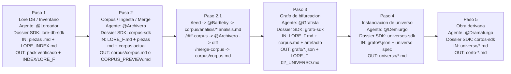

# engine-plan log — 2026-04-20

> Sesion de simulacion de la future-machine.
> Runtime: GPT-5.4

---

[06:31:51] @Pipeline      │ BOOT  │ future-machine v0.1-dev starting...
[06:31:51] @Pipeline      │ BOOT  │ runtime: GPT-5.4 — log-std mode
[06:31:51] @Pipeline      │ BOOT  │ scanning slots...
[06:31:52] @Loreador      │ READY │ slot_lore_db: mod/agents/loreador.agent.md loaded
[06:31:52] @Bartleby      │ READY │ slot_analysis: .github/agents/bartleby.agent.md loaded
[06:31:52] @Archivero     │ READY │ slot_corpus: .github/agents/archivero.agent.md loaded
[06:31:53] @Grafista      │ READY │ slot_grafo: mod/agents/grafista.agent.md loaded
[06:31:53] @Demiurgo      │ READY │ slot_universos: mod/agents/demiurgo.agent.md loaded
[06:31:53] @Dramaturgo    │ READY │ slot_obras: mod/agents/dramaturgo.agent.md loaded
[06:31:54] @Pipeline      │ READY │ slot_pipeline: mod/agents/pipeline.agent.md loaded
[06:31:54] @Portal        │ READY │ slot_portal: mod/agents/portal.agent.md loaded
[06:31:54] @Cristalizador │ READY │ meta: .github/agents/cristalizador.agent.md loaded
[06:31:55] @Pipeline      │ BOOT  │ ═══════════════════════════════════════════
[06:31:55] @Pipeline      │ BOOT  │ 9 READY, 0 BUILD, 0 MISS
[06:31:55] @Pipeline      │ BOOT  │ 32 tasks total: 6 cerradas, 26 libre
[06:31:55] @Pipeline      │ BOOT  │ critical path: PS-01 -> CS-01 -> GS-01 -> US-01 -> COS-01 -> FS-01 -> FS-05 -> FS-06 -> FS-04
[06:31:55] @Pipeline      │ BOOT  │ Machine fully operational at mod level; SDK main still has pending dossier work.
[06:31:55] @Pipeline      │ WARN  │ lore-routing.instructions.md still marks grafo/ as pending, but DRAFTS2/grafo/ exists with index.json, nodos.json, arcos.json, huecos.json, gramatica.md
[06:31:55] @Pipeline      │ WAIT  │ ready for commands

---

[06:31:56] @Pipeline      │ DATA  │ ═══════════════════════════════════════════
[06:31:56] @Pipeline      │ DATA  │ DIAGRAMA HORIZONTAL — paso / agente / dossier SDK / I-O
[06:31:56] @Pipeline      │ DATA  │ ═══════════════════════════════════════════

[06:31:57] @Pipeline      │ DATA  │ Tabla compacta para maquetacion horizontal:

| Paso | Agente | Dossier SDK | Entra | Sale |
|------|--------|-------------|-------|------|
| 1 | `@Loreador` | `lore-db-sdk` | piezas `LORE_*.md`, `LORE_INDEX.md`, schema e instrucciones | pack verificado, inventario, `LORE_F.md`/estado de lore |
| 2 | `@Archivero` | `corpus-sdk` | `LORE_F.md`, piezas `LORE_*.md`, corpus actual; subcadena interna: `@Bartleby` analiza | `corpus/corpus.md` o `DRAFTS2/CORPUS_PREVIEW.md` |
| 2.1 | `@Bartleby` -> `@Archivero` | `corpus-sdk` | `/feed corpus/editoriales/*.md` -> `corpus/analisis/*.analisis.md`; luego `/diff-corpus` sobre ese analisis | diff `NUEVO / CONFIRMA / DISCREPA / EVOLUCIONA`; despues `/merge-corpus` -> `corpus/corpus.md` actualizado |
| 3 | `@Grafista` | `grafo-sdk` | `LORE_F.md` + corpus + artefacto | `grafo/index.json`, `nodos.json`, `arcos.json`, `huecos.json`, `LORE_F-02_UNIVERSO.md` |
| 4 | `@Demiurgo` | `universos-sdk` | grafo JSON + spec universo | `DRAFTS2/universo/*.md` |
| 5 | `@Dramaturgo` | `cortos-sdk` | universo `.md` | corto `.md` por modelo + bench review |

[06:31:57] @Pipeline      │ DATA  │ Fila 2.1 y subnodo visual tomados del subflujo documentado en los guiones de mod/restitutiva: /feed -> @bartleby -> .analisis.md -> /diff-corpus -> @archivero -> /merge-corpus.
[06:31:57] @Pipeline      │ DATA  │ Transversales fuera de cadena principal: @Pipeline se corresponde con future-machine-sdk; @Portal queda como superficie de entrada, fuera de la tabla paso-a-paso.

[06:31:58] @Pipeline      │ DATA  │ Artefactos verificados en disco: 51 piezas en LORE_INDEX.md; corpus shim activo en corpus/corpus.md -> DRAFTS2/CORPUS_PREVIEW.md; grafo/index.json reporta 27 nodos, 35 arcos, 7 huecos; DRAFTS2/universo/ contiene universo-1, universo-1-r1, universo-1-r2, universo-2.
[06:31:58] @Pipeline      │ OK    │ Log inicial y diagrama horizontal persistidos en tmp/engine-log-2026-04-20-063151.md

---

[06:52:00] @Pipeline      │ DATA  │ ═══════════════════════════════════════════
[06:52:00] @Pipeline      │ DATA  │ PLUGINS DE FEATURES EXTRA — extensiones del pipeline
[06:52:00] @Pipeline      │ DATA  │ ═══════════════════════════════════════════

**Tabla A — Plugin / Componente / Agente**

| # | Plugin | Componente SDK | Agente(s) |
|---|--------|---------------|-----------|
| P1 | **Media Extractor** | `.github/skills/media-extraction/SKILL.md` | Cualquier agente (standalone skill) |
| P2 | **Sala + Dossier** | `.github/skills/dossier-feature/SKILL.md` + 8 prompts `sala-*.prompt.md` + `/dossier` | `@Aleph` (orquestador) + N agentes (multi-round) |
| P3 | **Future-Machine / engine-plan** | `.github/skills/engine-plan/SKILL.md` + `.github/prompts/engine-plan.prompt.md` | `@Cristalizador` → `@Pipeline` (runtime virtual `log`/`log-std`) |
| P4 | **Voice Crystallization** | `.github/skills/voice-crystallization/SKILL.md` | `@Dramaturgo` / `@Dramaturgo Cortos` (o cualquier agente) |

**Tabla B — Plugin / Dossier / I-O / Estado**

| # | Dossier SDK | Entra | Sale | Estado |
|---|-------------|-------|------|--------|
| P1 | — (sin dossier propio) | URL + timestamps (YouTube, Twitch VOD, HLS) | `tmp/media/*.wav` → STT → pieza `.md` en lore | `ya-usada` — E2E con yt-dlp, streamlink, faster-whisper. Cache en `tmp/media-cache/`. |
| P2 | — (es la infraestructura de todos los dossiers) | Feature brief del PO + `/dossier crear {nombre}` | PLAN, BACKLOG, RESPUESTAS, activacion, tasks → carpeta agente → Aleph copia | `ya-usada` — 13 dossiers activos, 2 sprints archivados. Disco > chat, R4. |
| P3 | `engine-plan-sdk` (19 tasks: 1 cerrada, 18 libre) | Workspace: contracts `.agent.md`, BACKLOGs, artefactos | Consola: `run`, `inspect`, `gaps`, `trace`, `coverage`... Output a `tmp/engine-log-*.md`. Verbos extensibles. | `ya-usada` — `log-std` operativo. Gates: hooks preview, MCP, plugins preview. |
| P4 | — (ref. en TASK-04/05 sprint-cristalizacion-v1) | `corpus/corpus.md` completo (firma de voz: 5 componentes Bartleby) | Texto *desde* el corpus: poema, manifiesto, pitch, prosa. Formato agnóstico. | `disponible` — probada via cortos multi-modelo. Sin dossier dedicado. |

[06:52:01] @Pipeline      │ DATA  │ Notas por plugin:

**P1 — Media Extractor:**
- Stack: `yt-dlp` (YouTube) / `streamlink` (Twitch VOD) / `faster-whisper` (STT local CTranslate2)
- Protocolo de cierre: verificar transcripción archivada → limpiar procesos vivos → preguntar al usuario qué hacer con cada pieza (`archivar en cache` / `eliminar` / `mantener`)
- GPU Windows: `nvidia-cublas-cu12` + `nvidia-cudnn-cu12` + `os.add_dll_directory()` antes de cargar modelo
- No tiene agente dedicado ni dossier: es tooling horizontal que cualquier agente invoca para ingestar medio audiovisual

**P2 — Sala + Dossier:**
- 9 comandos de sala: `/sala-aleph`, `/sala-entrar`, `/sala-seguir`, `/sala-aprobar`, `/sala-revisar`, `/sala-reconectar`, `/sala-salir`, `/sala-archivar`, `/dossier`
- Modelo orquestador-agentes: Aleph asigna, agentes trabajan en carpeta temporal, Aleph copia al destino tras aprobación
- Scaffold rico heredable: `plantilla-dossier/` con PLAN, BACKLOG, RESPUESTAS, activacion, tasks
- Dossiers sobreviven a sprints: los cerrados se archivan en `sala/archivo/sprint-{nombre}/dossiers/`

**P3 — Future-Machine / engine-plan:**
- Modo `log`/`log-std`: consola de simulación donde la future-machine arranca como runtime virtual
- Lenguaje de comandos: `run`, `inspect {agente}`, `gaps`, `status`, `data {nodo}`, `spec {nodo}`, `docs {nodo}`, `trace {marca}`, `coverage`, `exit`
- Extensible: los verbos del modo consola se diseñan por afinidad con el dominio; el skill define el protocolo de ejecución, no una lista cerrada
- `log-std` = todo a fichero, chat mínimo. Un fichero por sesión, append secuencial
- Dossier `engine-plan-sdk`: 19 tasks con ruta crítica EP-01 → EP-02 → ... → EP-10. Tiers condicionados: hooks, MCP, plugins

**P4 — Voice Crystallization:**
- Inverso de `documental-analysis`: corpus → texto (no texto → corpus)
- Lee los 5 componentes de la firma de voz: identidad de corriente, vocabulario taxonómico, proporciones retóricas, tensiones productivas, registro activo
- No resuelve tensiones del corpus: las reproduce o las lleva un paso más lejos
- Formato agnóstico: la skill define la voz; el mod define el formato de salida (poema, manifiesto, pitch, etc.)
- Ya usada implícitamente en los cortos multi-modelo (`LORE_F-02_CORTO-universo-*`)

[06:52:02] @Pipeline      │ OK    │ Tabla de plugins persistida en tmp/engine-log-2026-04-20-063151.md